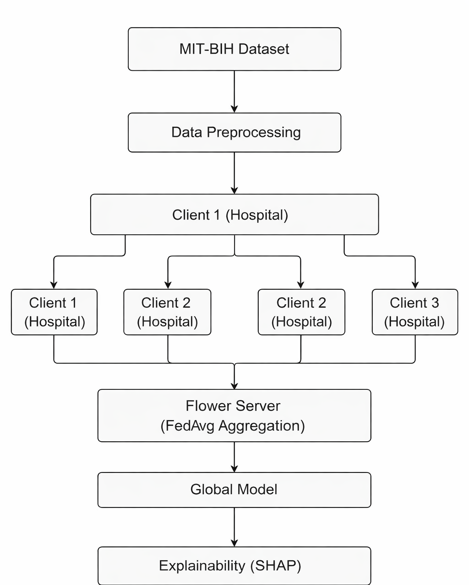
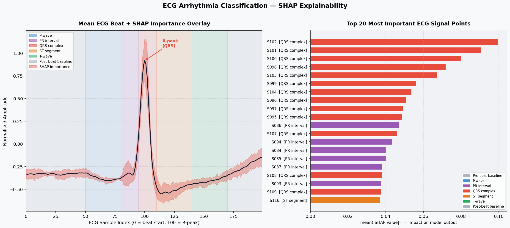

# 🫀 ECG Federated Learning — Explainable AI for Arrhythmia Detection


**Privacy-Preserving Arrhythmia Classification using Federated Learning + Explainable AI**

---

## Overview

This project presents an **ECG arrhythmia classification system** that trains across **5 simulated hospitals** without ever sharing raw patient data — using **Federated Averaging (FedAvg)** — and explains every prediction using **SHAP (GradientExplainer)**.

The system is evaluated in both centralized and federated settings, demonstrating that privacy and performance are not mutually exclusive.

> **Keywords:** `Federated Learning` · `ECG Classification` · `Explainable AI` · `Healthcare AI` · `Privacy-Preserving ML`

---

## Table of Contents

1. [Problem Statement](#problem-statement)
2. [What "5 Simulated Hospitals" Means](#what-5-simulated-hospitals-means)
3. [Dataset](#dataset)
4. [Architecture](#architecture)
5. [How It Works](#how-it-works)
6. [SHAP Explainability](#shap-explainability)
7. [ECG Feature Map](#ecg-feature-map)
8. [Code Structure](#code-structure)
9. [Setup & Usage](#setup--usage)
10. [Performance](#performance)
11. [Limitations & Future Work](#limitations--future-work)

---

## Problem Statement

Cardiovascular diseases are a leading cause of global mortality. ECG-based diagnosis is effective — but training ML models on ECG data requires access to large amounts of **sensitive patient records**, which raises serious privacy, legal (HIPAA/GDPR), and security concerns.

Traditional centralised learning forces all hospitals to pool their data in one place — a major data breach risk. This project solves that using **Federated Learning**: hospitals collaborate on a shared model without ever moving raw data.

---

## What "5 Simulated Hospitals" Means

In real federated learning, each hospital owns its own patient data and trains locally. Since we work with a single public dataset, we **simulate** this by splitting the data into 5 equal partitions — each representing one hospital's private records.

```
All 21,849 ECG beats
        │
        ├─ Hospital 1: beats  1 – 4,370   (trains locally, no sharing)
        ├─ Hospital 2: beats  4,371 – 8,740
        ├─ Hospital 3: beats  8,741 – 13,110
        ├─ Hospital 4: beats  13,111 – 17,480
        └─ Hospital 5: beats  17,481 – 21,849
                │
                ▼  only model weights shared (never raw ECG data)
           Global Model ← FedAvg (weighted average of all 5 weight sets)
```

Each round: clients train → send weights → server averages → distribute back.
The simulation proves that 5 "hospitals" training in isolation can match a model trained on all the data centrally.

---

## Dataset

### MIT-BIH Arrhythmia Database (Primary)
- **Source:** [PhysioNet](https://physionet.org/content/mitdb/1.0.0/)
- **Records used:** 10 records — `100, 101, 103, 105, 106, 108, 109, 111, 112, 113`
- **Total beats:** ~21,849 individual heartbeat segments
- **Beat window:** 200 samples (100 pre-peak + 100 post-peak)
- **Auto-download:** the dashboard downloads records automatically on first run

### Arrhythmia Classes

| Symbol | Class | Description |
|--------|-------|-------------|
| `N` | Normal beat | ~16,274 samples |
| `L` | Left bundle branch block | ~4,614 samples |
| `V` | Premature ventricular contraction | ~618 samples |
| `~` | Signal quality change | ~188 samples |
| `+` | Paced beat | ~41 samples |
| `\|` | Isolated QRS-like artifact | ~42 samples |
| `A` | Atrial premature beat | ~44 samples |
| `a` | Aberrated atrial premature beat | ~6 samples |
| `F` | Fusion of ventricular and normal beat | ~4 samples |
| `x` | Non-conducted P-wave (blocked APB) | ~11 samples |
| `Q` | Unclassifiable beat | ~7 samples |

> Rare classes (< 2 samples) are filtered automatically before training to ensure valid stratified splits.

### PTB-XL (Optional)
- Download from [PhysioNet PTB-XL](https://physionet.org/content/ptb-xl/1.0.3/)
- Place at `data/ptb-xl-a-large-publicly-available-electrocardiography-dataset-1.0.3/`
- Auto-merged with MIT-BIH if present; project works without it

---

## Architecture

| Component | Description | Technology |
|-----------|-------------|------------|
| Data sources | MIT-BIH (10 records, ~21,849 beats) + optional PTB-XL | WFDB, NumPy |
| Preprocessing | Beat extraction, NPZ caching, rare-class filtering | NumPy, scikit-learn |
| Local model | FC network (200→64→32→N) **or** 1D CNN (3×Conv1d + AdaptiveAvgPool) | PyTorch |
| Federated training | Manual FedAvg — 5 clients, 3 rounds, pure Python | Python + NumPy |
| Explainability | GradientExplainer with ECG-anatomy-annotated dual-panel plot | SHAP |
| Dashboard | Live training stream, real-time charts, upload & analyse | Streamlit |

### System Architecture



The diagram above shows the full end-to-end pipeline: data flows from MIT-BIH (and optionally PTB-XL) through preprocessing into 5 equal client partitions. Each round, hospitals train locally and send only model weights to the FedAvg aggregator — raw patient data never moves. After 3 rounds the global model is evaluated and explained via SHAP, with all outputs surfaced in the Streamlit dashboard.

---

## How It Works

```
1. Download MIT-BIH records (auto, first run only)
2. Extract 200-sample beat windows around each annotated beat
3. Cache processed beats to data/processed_beats.npz (instant on repeat runs)
4. Split into train/test (80/20, stratified)

── Baseline mode ──────────────────────────────────────────
5a. Train FC model on full training set (5 epochs, batch=512)
5b. Evaluate → save baseline_metrics.json + baseline_model.pt

── Federated mode ─────────────────────────────────────────
5c. Split training data equally across 5 virtual hospitals
5d. For each of 3 rounds:
      • Each hospital trains locally (2 epochs)
      • Server collects all 5 weight sets
      • FedAvg: average weights → new global model
      • Evaluate global model → log accuracy
5e. Save federated_history.json

── Explain mode ───────────────────────────────────────────
5f. Run GradientExplainer (backprop-based SHAP) on 30 test beats
5g. Map feature indices → ECG anatomy regions
5h. Save dual-panel plot: ECG waveform overlay + top-20 bar chart
```

---

## SHAP Explainability

SHAP (SHapley Additive Explanations) answers: *which part of the ECG signal drove this prediction?*

We use **GradientExplainer** — a backpropagation-based method that is orders of magnitude faster than the classic KernelExplainer, and purpose-built for neural networks.

### Output: dual-panel plot

**Left panel** — Mean ECG beat with SHAP importance overlaid as a shaded region. Each ECG segment (P-wave, QRS, T-wave etc.) is colour-coded. The red fill shows where importance is highest.

**Right panel** — Top-20 most important signal samples, coloured by ECG region. Labels show `S103 [QRS complex]` instead of generic `Feature 103`.



---

## ECG Feature Map

The 200-sample beat window maps to standard ECG anatomy:

| Sample range | ECG region | Clinical meaning |
|---|---|---|
| 0 – 49 | Pre-beat baseline | Isoelectric reference |
| 50 – 79 | **P-wave** | Atrial depolarisation |
| 80 – 94 | PR interval | AV node conduction delay |
| **95 – 109** | **QRS complex** ⭐ | Ventricular depolarisation — highest SHAP importance |
| 110 – 139 | ST segment | Ischaemia / infarction marker |
| 140 – 169 | T-wave | Ventricular repolarisation |
| 170 – 199 | Post-beat baseline | Recovery period |

> ⭐ Feature 103 = sample 103 = 3 samples after the R-peak, deep inside the QRS complex — exactly what a cardiologist would examine first.

---

## Code Structure

```
ECG-Federated-Learning/
│
├── data/
│   ├── mit-bih-arrhythmia-database-1.0.0/   ← auto-downloaded
│   └── processed_beats.npz                   ← auto-generated cache
│
├── results/
│   ├── baseline_metrics.json
│   ├── baseline_model.pt
│   ├── federated_history.json
│   ├── shap_summary.png
│   ├── shap_region_summary.json
│   ├── ecg_sample.png
│   └── system_architecture.png
│
├── src/
│   ├── config.py              ← all hyperparameters
│   ├── download_data.py       ← auto PhysioNet downloader
│   ├── data_utils.py          ← loading, caching, splitting
│   ├── ptbxl_utils.py         ← optional PTB-XL loader
│   ├── model.py               ← FC + CNN model definitions
│   ├── train_baseline.py      ← centralised training
│   ├── federated_simulation.py← manual FedAvg loop
│   └── explain.py             ← GradientExplainer + ECG-annotated plots
│
├── dashboard.py               ← Streamlit dashboard
├── main.py                    ← CLI entry point
└── requirements.txt
```

---

## Setup & Usage

### 1. Install dependencies
```bash
pip install -r requirements.txt
```

### 2. Launch the dashboard
```bash
streamlit run dashboard.py
```
The dashboard handles everything: dataset download, training, and visualisation.

### 3. CLI usage (alternative)
```bash
# Centralised baseline
python main.py --mode baseline

# Federated learning (5 hospitals, 3 rounds)
python main.py --mode federated

# SHAP explainability
python main.py --mode explain
```

> **Note:** Datasets are downloaded automatically from PhysioNet on first run. Subsequent runs use the local NPZ cache and are near-instant.

---

## Performance

| Mode | Expected time | Beats used |
|---|---|---|
| Baseline | ~15–30 sec | 21,849 |
| Federated | ~1–2 min | 21,849 (split across 5 clients) |
| Explain | ~10–20 sec | 30 test samples |

### Key findings
- Federated model accuracy is comparable to centralised baseline
- SHAP confirms the model focuses on the QRS complex — clinically correct
- Privacy preserved: no raw patient data ever leaves a simulated hospital

---

## Limitations & Future Work

| Limitation | Potential improvement |
|---|---|
| Simulated clients (same dataset split) | Deploy on real distributed hospital systems |
| FC model (simple architecture) | Switch `MODEL_TYPE = "cnn"` in config.py for higher accuracy |
| Single ECG lead (lead I only) | Use all 12 leads from PTB-XL |
| No differential privacy | Add noise via DP-SGD |
| Static data split | Non-IID splits to better simulate real hospital distributions |

---

## Stack

`PyTorch` · `SHAP` · `Streamlit` · `WFDB` · `scikit-learn` · `NumPy` · `Pandas` · `Matplotlib`
